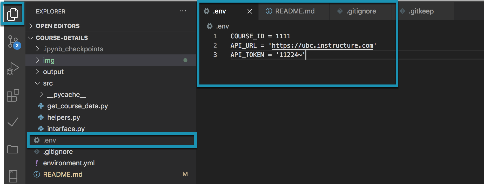
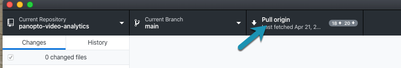
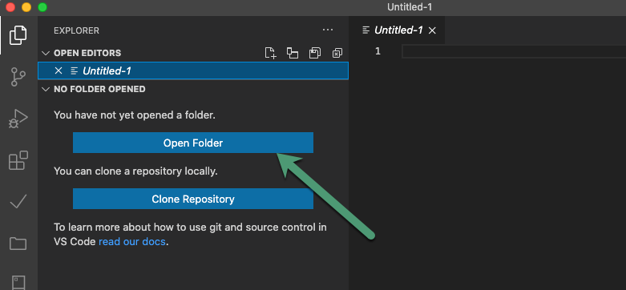
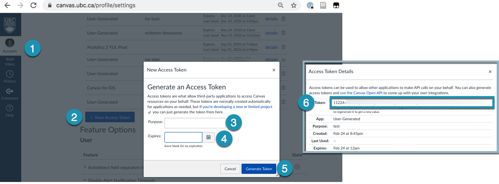
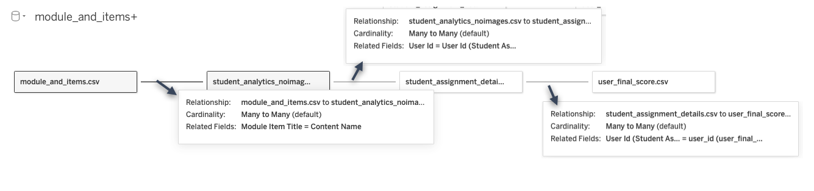

# Canvas Course Details

> The "Ikea" Project

Given a course id, extracts details of course and combines with collected New Analytics extracts. 

## 🗂 Data
### Skeleton
- [assignments](https://canvas.instructure.com/doc/api/assignments.html#method.assignments_api.index)
- [quizzes](https://canvas.instructure.com/doc/api/quizzes#method.quizzes/quizzes_api.index) 
- [pages](https://canvas.instructure.com/doc/api/pages#method.wiki_pages_api.index)
- [enrollments](https://canvas.instructure.com/doc/api/enrollments.html#method.enrollments_api.index)
- [tabs (navigation)](https://canvas.instructure.com/doc/api/tabs.html#method.tabs.index) 
- [discussion_topics](https://canvas.instructure.com/doc/api/discussion_topics.html#method.discussion_topics.index)
- [modules](https://canvas.instructure.com/doc/api/modules.html#method.context_modules_api.index)
- [module_items](https://canvas.instructure.com/doc/api/modules.html#method.context_module_items_api.index)
- [files](https://canvas.instructure.com/doc/api/files#method.files.api_index)

### Course Details
- page_links *TODO*
  
### Student Details
- student_discussion_responses *TODO*
- [student_submissions](https://canvas.instructure.com/doc/api/submissions#method.submissions_api.for_students)

### Student Interaction
- A user can download student interaction data in Canvas from New Analytics. Given that the data is downloaded consistently (Canvas only has 27 days in New Analytics), and stored in `data/{COURSE_ID}/user_input/new_analytics_input` when prompted, the goal is to be able to combine student interaction with other course and student data for a "full picture" of the course and its activity. 
- The assumption is you are using the **direct download** of New Analytics data. 


## 🚀 Use

### Downloading New Analytics

The project relies on a regular download of Canvas's New Analytics data, and assumes you use the **direct download**. The direct download and the "regular" download have different file headings, but the activity data should be the same. On a regular (bi-weekly, every third week) basis, you should be downloading the New Analytics data - the scripts will prompt you to add the data to the correct folder when needed.

1. Navigate to New Analytics -> `Reports`
2. Select `Run Report` for Course Activity
3. Select the `(info)` icon next to Results
4. Select `direct download` to download the full dataset


### Computer Setup

1. We use conda, and suggest miniconda for your projects: [Install Miniconda](https://docs.conda.io/en/latest/miniconda.html) -> whichever the latest 3.x version is, use the 'pkg' version if you are unfamiliar with bash
2. We also like VSCode: [Install VSCode](https://code.visualstudio.com), and the [Python Extension](https://code.visualstudio.com/docs/python/python-tutorial#_prerequisites)
3. You also need to have Git installed. We like [GitHub Desktop](https://desktop.github.com/) if you aren't familiar with terminal

### Project Setup
1. Clone this project
2. Create the environment `canvas-get-course-details` (in terminal) 
> `$ conda env create -f environment.yml`
3. In this project folder (course-details), create a .env file with the following, save in course-details folder
```
COURSE_ID = your_course_id
API_URL = 'https://ubc.instructure.com'
API_TOKEN = 'your_token'
```
> ⚠️ Your token should be kept private and secure. We recommend setting expiry on your tokens, and deleting from Canvas once no longer needed. 

Creating a .env file in VSCode is easy. in the File Explorer right click, add a new file. The file is called .env, and then you can edit it as needed in the editor window.


### Every Time

#### 1. Get the most recent version
 Go to GitHub Desktop and make sure you pull the latest version of the project.

<br>
#### 2. Open VS Code, and open the course-details folder

<br>
#### 3. Confirm you have your .env file setup, with the right `COURSE_ID` and an active `API_TOKEN`
   
   

   Reminder - creating a token:
   


#### 4. Make sure your terminal in VSCode is in the right directory
In the terminal in VS Code:
   - Make sure you are in the right directory 
   - if you opened the folder in vscode and see the project files in the explorer, then you are in the right directory 
   - if you are unsure, check with the command:
      > `$ pwd`

   - if you are not in the right directory, you can use `cd` in terminal to navigate, for example if the project is in Documents/GitHub/course-details
      > `$ cd "Documents/GitHub/course-details"` 

#### 5. Activate the environment
   - Activate the environment by entering these in order (this should have been created in project setup)
      1. > `$ conda deactivate`
      2. > `$ conda activate canvas-get-course-details`
 
#### 6. Run the scripts! (In terminal:)
> *The scripts will require user input - indicated in Blue. You will get confirmations of success in Green. If anything goes terribly wrong you will see Red output in terminal.*
 
#### Running will do the following:
- extract canvas data from the course specified in the .env file
- ask you to add new analytics data to a specific folder
- ask you to add a "gradebook.csv" into a specific folder 
- create several versions of data: original_data (as-is from Canvas), cleaned_data (renamed and reduced columns), and tableau_data (which is the format needed to use the Tableau template)


You just need to run one command and follow the prompts: 
> `$ python src/do_it_all.py` 

Note: this will replace any existing data if you have extracted data before. There will also be a number of inputs in terminal to enter. 

**If you've successfully run all of the scripts, then you're done!** 

You should now see the folders for your course:

- project_data
    - cleaned_data
        - transformations
    - original_data
    - tableau_data
- user_input

## Tableau Demo Dashboard and Data

We have included a zip file `Demo Dashboard and Data.zip` that contains sample data in the form you would find in `project_data/tableau_data`. The sample data itself may not be accurate, for instance the assignments don't add up to the final grade - it is simply for demonstration purposes. You should be able to replace the data with your own in the Tableau workbook. See Tableau's guides to updating / replacing data sources: <https://help.tableau.com/current/pro/desktop/en-us/connect_basic_replace.htm> 

Here are the connections between the data sources




## 🌟 Acknowledgements & Contributions
This project relies heavily on the [CanvasAPI](https://github.com/ucfopen/canvasapi) python library from The University of Central Florida's open source software projects - [UCF Open](https://ucfopen.github.io/).

### Contributers

[**Sauder Learning Services**](https://www.sauder.ubc.ca/about-ubc-sauder/learning-services/people)
- [Marko Prodanovic](https://github.com/markoprodanovic), Data Analyst & Media Specialist
- [Alison Myers](https://github.com/alisonmyers), Research Analyst
